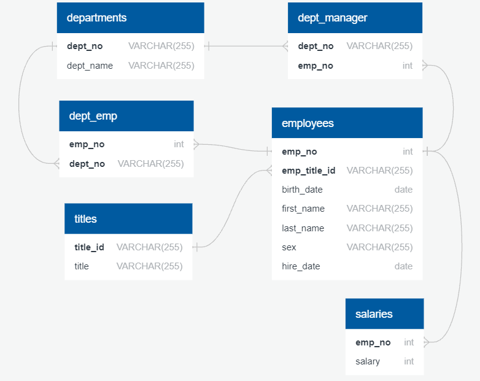
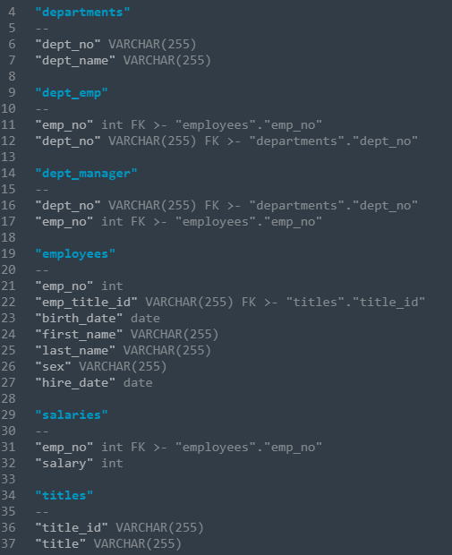
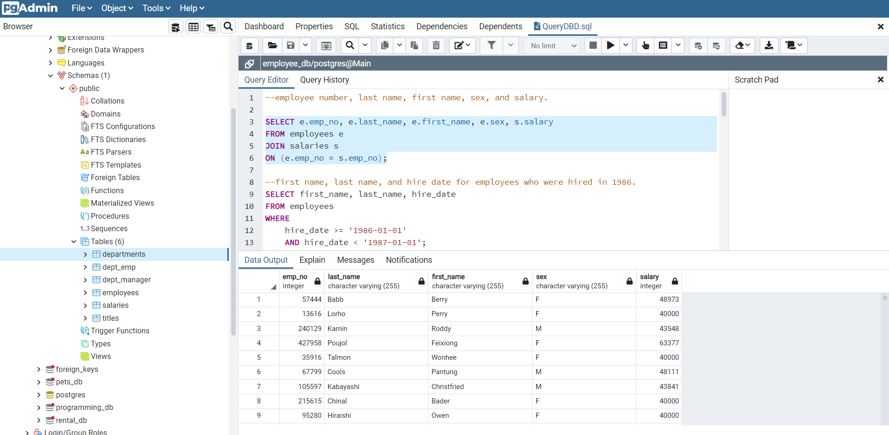

# SQL-Challenge
# Employee Reporting
## By Michael Thomas

The goal of this project was to explore the employee database and answer a number of business questions.

PostgresAdmin was used to import the information together into DB tables by building schemas. 
SQL query was used to query the data

## DATA
All data in our tables was imported from .CSVs containg the given table information:
- departments	
- dept_emp	
- dept_manager	
- employees	
- salaries	
- titles	

## SQL Queries

I ran a number of sql queries based on the following business requests

- employee number, last name, first name, sex, and salary.
- first name, last name, and hire date for employees who were hired in 1986.
 -manager of each department with the following information: department number, department name, the manager's employee number, last name, first name.
- List the department of each employee with the following information: employee number, last name, first name, and department name.
- List first name, last name, and sex for employees whose first name is "Hercules" and last names begin with "B."
- List all employees in the Sales department, including their employee number, last name, first name, and department name.
- List all employees in the Sales and Development departments, including their employee number, last name, first name, and department name.
- In descending order, list the frequency count of employee last names, i.e., how many employees share each last name.

